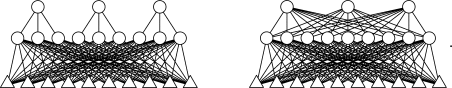

## Partially Connected Feedforward Neural Network (PCFNN)




### Introduction

Feedforward neural network are used for classification and regression.


### Initialisation

First include headers
```c
#include <ANN/models/PCFNN/PCFNN.h>
#include <ANN/tools.h> // for initialisation function, activation function, cost function
```

#### Manual method

With the following method, you can create complex neural networks with partial or total connections between neuron layers.

So you can create a new PCFNN
```c
struct PCFNN_NETWORK *net = PCFNN_NETWORK_new();
```
For the moment the network is totally empty.
You need to add some layers.
So let's create a new input layer with 42 neurons.
```c
struct PCFNN_LAYER *l1 = PCFNN_LAYER_new_input(42, f_act_input, f_act_input_de);
```
and 1 hidden layer
```c
struct PCFNN_LAYER *l2 = PCFNN_LAYER_new(NULL, NULL, NULL); // you can precise the default initialisation function, activation function and the derivative activation function
```
and 1 output layer.
```c
struct PCFNN_LAYER *l3 = PCFNN_LAYER_new(NULL, NULL, NULL);
```

Then you can add those new layers to the network (add then in the order of layers bonds).
```c
PCFNN_NETWORK_addl(net, l1);
PCFNN_NETWORK_addl(net, l2);
PCFNN_NETWORK_addl(net, l3);
```

Now you can configure the hidden layer and the output layer.
So we will link all neurons from the input layer l1 with an offset of 0 neurons to the 64 neurons in l2 with and offset of 0 neurons and we will use the provided initialisation function and the sigmoid activation function to create new neurons in the hidden layer l2.
```c
PCFNN_LAYER_connect(l1, l2, 42, 64, 0, 0, f_init_rand_norm, f_act_sigmoid, f_act_sigmoid_de);
```

Then we can connected the hidden layer l2 to the output layer l3 and we want 2 neurons in l3
```c
PCFNN_LAYER_connect(l2, l3, 64, 2, 0, 0, f_init_rand_norm, f_act_sigmoid, f_act_sigmoid_de);
```

Now the neural network is well configured.
So we can build it!
```c
PCFNN_NETWORK_build(net);
```

And that's all!


#### Automatic method

With the following method, you can create a fully connected neural networks from an array of integers.

For example, we want 1 input layer with 2 neurons, 1 hidden layer with 2 neurons and 1 output layer with 1 neurons.
It's a XOR neural network.
With this information, we can build the following array.
```c
size_t number_of_layers = 3;
size_t neurons_per_layers[] = {2, 2, 1};
```

We will use the sigmoid activation function and the default initializer.

Call this function and your neural network is ready!
```c
struct PCFNN_NETWORK *net = PCFNN_NETWORK_build_from_array(neurons_per_layers, number_of_layers, f_init_rand_norm, f_act_sigmoid, f_act_sigmoid_de);
```

### Computing

Create an array with the input data. The size of this array must be equal to the input layer size; here 42.
```
double input[42];
```
Initialize this array and call

Then you can use this function.
```c
PCFNN_NETWORK_feedforward(net, input);
```

To get the output of the network, use this function:
```c
double *output = PCFNN_NETWORK_get_output(net);
```
The size of output is equal to the output layer size.
This pointer must be free after usage.


### Training

Imagine you want to train the network and you have a 100 items in your dataset.
So the size of your dataset is 100.
So you can initialize 2 array of 100 double pointer:
```c
double *inputs[100];
double *targets[100];
```
The size of each array in input must be equal to the input layer size; here 42.
And the size of each array in target must be equal to the output layer size; here 2.
Now initialize each array with your dataset.

To train the network we will use a learning rate of 0.1 and a momentum of 0.8 with 20000 epochs with a batch size of 2 and we want the dataset to be shuffle after each epochs.
We also want to use the last 25%(1/4) of our dataset to validate the training.
For the cost function, we will use the quadractic loss function.
```c
double status;
double *validation = PCFNN_NETWORK_train(
    net, // our network
    inputs, // input dataset
    targets, // target dataset
    100, // dataset size
    0.25, // 25% = 0.25: the validation ratio
    1, // shuffle mode enable
    2, // batch_size of 2
    20000, // 20000 epochs
    0.1, // a learning rate of 0.1
    0.8, // a momentum of 0.8
    f_cost_quadratic_loss, // quadractic loss function
    f_cost_quadratic_loss_de, // quadractic loss function derivative
    &status); // percentage of completion. usefull with thread.
```
When the training is done, you will have the validate pointer.
It's an array of the average of the loss of each output neuron.


### Free the network after usage!

If you don't need anymore to use the network, you can call
```c
PCFNN_NETWORK_free(net);
```
This function will free the network and all layers linked to the network for you!


### Input/Output

If you want to save the configuration of the PCFNN, you can use the following function:
```c
PCFNN_NETWORK_save_conf(net, fout); //net is a struct PCFNN_NETWORK* and fout is a FILE* that is pointed to the output file
```

If you want to load it again, initialize the network and use the following function:
```c
PCFNN_NETWORK_load_conf(net, fin); //net is a struct PCFNN_NETWORK* and fin is a FILE* that is pointed to the input file
```

### More informations

Read the documentation !


### Example: the XOR function

- code: 
```c
#include <stdlib.h>
#include <stdio.h>
#include <time.h>
#include <ANN/models/PCFNN/PCFNN.h>
#include <ANN/tools.h>

int main(int argc __attribute__((unused)), char *argv[] __attribute__((unused)))
{
    srand(time(NULL));

    // Configuration of the network
    struct PCFNN_NETWORK *net = PCFNN_NETWORK_new();
    struct PCFNN_LAYER *l1 = PCFNN_LAYER_new_input(2, f_act_input, f_act_input_de);
    struct PCFNN_LAYER *l2 = PCFNN_LAYER_new(NULL, NULL, NULL);
    struct PCFNN_LAYER *l3 = PCFNN_LAYER_new(NULL, NULL, NULL);
    PCFNN_NETWORK_addl(net, l1);
    PCFNN_NETWORK_addl(net, l2);
    PCFNN_NETWORK_addl(net, l3);

    PCFNN_LAYER_connect(l1, l2, 2, 2, 0, 0, f_init_rand_norm, f_act_sigmoid, f_act_sigmoid_de);
    PCFNN_LAYER_connect(l2, l3, 2, 1, 0, 0, f_init_rand_norm, f_act_sigmoid, f_act_sigmoid_de);

    // Building the network
    PCFNN_NETWORK_build(net);

    //Print the neural network summary
    PCFNN_NETWORK_print_summary(net);

    // Creation of the dataset
    double i1[] = {0, 0}; double t1[] = {0};
    double i2[] = {1, 0}; double t2[] = {1};
    double i3[] = {0, 1}; double t3[] = {1};
    double i4[] = {1, 1}; double t4[] = {0};
    double *inputs[] = {i1, i2, i3, i4};
    double *target[] = {t1, t2, t3, t4};

    PCFNN_NETWORK_train(net, inputs, target,
                         4, 0.0, 1, 2, 25000, 0.25, 0.9, f_cost_quadratic_loss, f_cost_quadratic_loss_de, NULL);
    // Train the network with the dataset with 25000 epochs, a learning rate of 0.25 and a momentum of 0.9


    double *outt = PCFNN_NETWORK_train(net, inputs, target,
                         4, 1, 0, 0, 0, 0, 0, f_cost_quadratic_loss, f_cost_quadratic_loss_de, NULL);
    // Get the validation


    for(size_t j = 0; j < 4; ++j)
    {
        PCFNN_NETWORK_feedforward(net, inputs[j]);
        double *out = PCFNN_NETWORK_get_output(net);
        printf("\n %f XOR %f = %f | expected: %f", inputs[j][0], inputs[j][1], out[0], target[j][0]);
        free(out);
    }
    printf("\nLoss: %f%%\n", outt[0]);

    free(outt);
    PCFNN_NETWORK_free(net); // free the network

    return EXIT_SUCCESS;
}
```

- output:
```
===
   PCFNN_NETWORK: summary
* Neural network ram usage: 1.37 Ko
* Number of layers: 3
* Number of neurons: 5
--
* Layer summary: 
    - [I] layer: n°0    : 2 neurons
             links: 
                   - 0 -> 1 | (0, 2) -> (0, 2)
    - [H] layer: n°1    : 2 neurons
             links: 
                   - 0 -> 1 | (0, 2) -> (0, 2)
                   - 1 -> 2 | (0, 2) -> (0, 1)
    - [O] layer: n°2    : 1 neurons
             links: 
                   - 1 -> 2 | (0, 2) -> (0, 1)
--
* Number of unlocked parameters: 11
* Number of locked parameters: 0
===

 0.000000 XOR 0.000000 = 0.007418 | expected: 0.000000
 1.000000 XOR 0.000000 = 0.995446 | expected: 1.000000
 0.000000 XOR 1.000000 = 0.995238 | expected: 1.000000
 1.000000 XOR 1.000000 = 0.005537 | expected: 0.000000
Loss: 0.000016
```
